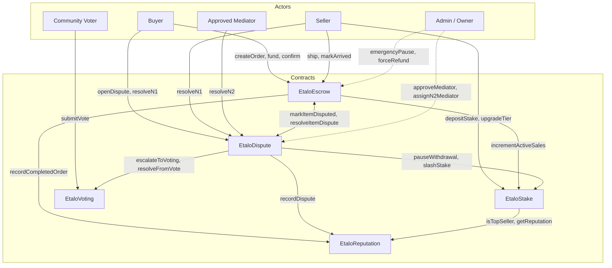

# Etalo V2 Smart Contracts

Etalo's V2 smart contract suite powers a **non-custodial escrow for
social commerce** on Celo. Five contracts work together to hold
buyer funds in escrow, release them progressively as shipments
reach their destinations, and resolve disputes through a
permissionless three-level chain (bilateral → mediator → community
vote).

All funds live in public smart contracts on Celo — no company
account holds buyer money at any point. Mediator power is
structurally bounded by code per ADR-022 (non-custodial claim under
the Zenland / Circle Refund Protocol standard).

**Status:** V2 contracts deployed to Celo Sepolia (testnet) on
2026-04-24. Pre-audit; audit phase 3 scheduled for Q4 2026
(ADR-025). Source verified on three independent explorers
(Etherscan-compat CeloScan, Blockscout, Sourcify).

For a 30-minute technical deep-dive, read
`docs/SPEC_SMART_CONTRACT_V2.md`. For the audit trail, static
analysis report, and testnet smoke-test results, read
`docs/SECURITY.md`.

---

## Deployed Addresses (Celo Sepolia, chainId 11142220)

| Contract | Address | Source |
|---|---|---|
| `MockUSDT` (test USDT) | `0x5ce5EBA46a72EA49655367c57334E038Ea1Aa1f3` | [CeloScan](https://sepolia.celoscan.io/address/0x5ce5EBA46a72EA49655367c57334E038Ea1Aa1f3#code) |
| `EtaloReputation` | `0x2a6639074d0897c6280f55b252B97dd1c39820b7` | [CeloScan](https://sepolia.celoscan.io/address/0x2a6639074d0897c6280f55b252B97dd1c39820b7#code) |
| `EtaloStake` | `0xBB21BAA78f5b0C268eA66912cE8B3E76eB79c417` | [CeloScan](https://sepolia.celoscan.io/address/0xBB21BAA78f5b0C268eA66912cE8B3E76eB79c417#code) |
| `EtaloVoting` | `0x335Ac0998667F76FE265BC28e6989dc535A901E7` | [CeloScan](https://sepolia.celoscan.io/address/0x335Ac0998667F76FE265BC28e6989dc535A901E7#code) |
| `EtaloDispute` | `0x863F0bBc8d5873fE49F6429A8455236fE51A9aBE` | [CeloScan](https://sepolia.celoscan.io/address/0x863F0bBc8d5873fE49F6429A8455236fE51A9aBE#code) |
| `EtaloEscrow` | `0x6caEBc6aDc5082f6B63282e86CaF51AEbd630bfb` | [CeloScan](https://sepolia.celoscan.io/address/0x6caEBc6aDc5082f6B63282e86CaF51AEbd630bfb#code) |

Treasury wallets (three-wallet separation per ADR-024):

| Role | Address |
|---|---|
| `commissionTreasury` — platform fees | `0x9819c9E1b4F634784fd9A286240ecACd297823fa` |
| `creditsTreasury` — asset-generator revenue (V1.5) | `0x4515D79C44fEaa848c3C33983F4c9C4BcA9060AA` |
| `communityFund` — slashed-stake surplus | `0x0B15983B6fBF7A6F3f542447cdE7F553cA07A8d6` |

Blockscout and Sourcify verification links for every contract, plus
transaction hashes and block numbers for deployment and wiring, are
in `packages/contracts/deployments/celo-sepolia-v2.json` and
`docs/SECURITY.md` (Contract verification + Deployed addresses
sections).

**Mainnet:** not deployed yet. Mainnet deployment is gated on
ADR-025 audit phase 3 completion.

---

## Architecture Overview

### Inter-contract graph

Five contracts coordinate the escrow + dispute flow. USDT transfers
happen at the `Escrow` and `Stake` boundaries; reputation and
community vote are separate concerns with narrow interfaces.

All USDT transfers happen through the USDT ERC-20 contract
(`0x48065fbBE25f71C9282ddf5e1cD6D6A887483D5e` on Celo mainnet,
`MockUSDT` at `0x5ce5EBA46a72EA49655367c57334E038Ea1Aa1f3` on Sepolia
testnet for development). USDT is not shown in the graph below —
it's the settlement rail for every transfer labeled `ship`, `fund`,
`release`, etc.



Solid arrows are runtime USDT or state flows. Dashed arrows are
admin-only paths, each bounded by code per ADR-022 and ADR-023
(every admin function is scoped by codified conditions — no
discretionary power over user funds).

### Entity hierarchy

```
Order
├── ShipmentGroup 1
│   ├── Item A
│   └── Item B
└── ShipmentGroup 2
    ├── Item C
    ├── Item D
    └── Item E
```

An **Order** has a buyer, a seller, and 1-50 **Items** (each with
its own price). Items are grouped into **ShipmentGroups** by the
seller at shipping time — each group gets its own proof-of-shipment
and progresses independently through Arrived → Released states.
This lets cross-border sellers ship multi-parcel orders without
freezing the whole order on a single tracking delay.

Disputes are item-level: one disputed item does not block sibling
items from being released (**sibling isolation**, ADR-015). This was
the core motivation for replacing V1's flat order model with the
Order / ShipmentGroup / Item hierarchy (ADR-017 removed the
previous 4 × 25% milestone progression in favor of this structure).

### "Sole authority" convention (ADR-030)

To prevent double-counting reputation events, each reputation
mutation has exactly one caller:

- `EtaloEscrow._releaseItemFully` → `reputation.recordCompletedOrder`
- `EtaloDispute._applyResolution` → `reputation.recordDispute`

No other code paths touch `Reputation` for dispute or completion
events. The contract is otherwise read-only from other contracts
(tier eligibility reads in `Stake`, Top Seller discount reads in
`Escrow`).

---

## Per-Contract Reference

### EtaloReputation

EtaloReputation tracks per-seller aggregate data — completed
orders, disputes, total volume, Top Seller status — and emits
events that downstream contracts use to gate behavior (commission
discount, stake eligibility).

**Key state**:
- `isAuthorizedCaller[address] → bool` — only Escrow and Dispute can mutate reputation (wired at deploy via `setAuthorizedCaller`).
- `_reputations[address] → SellerReputation` — private mapping; read via `getReputation(addr)` view.
- `SellerReputation` struct fields: `ordersCompleted`, `ordersDisputed`, `disputesLost`, `totalVolume`, `score`, `isTopSeller`, `status`, `lastSanctionAt`, `firstOrderAt`.

**Main user-facing functions**:
- `getReputation(address) view returns (SellerReputation)` — full struct read.
- `isTopSeller(address) view returns (bool)` — 1-bit read used by Stake and Escrow.
- All mutating functions are `onlyAuthorized` (see Gotchas).

**Events**: see `IEtaloReputation.sol` — OrderRecorded, DisputeRecorded, TopSellerGranted, TopSellerRevoked, SellerSanctioned, ScoreUpdated.

**Gotchas / invariants**:
- **Sole authority (ADR-030)**: `recordCompletedOrder` is called only from `EtaloEscrow._releaseItemFully`; `recordDispute` is called only from `EtaloDispute._applyResolution`. No other path touches these; duplicating would double-count `disputesLost` and `ordersCompleted`.
- **Top Seller criteria (ADR-020)**: ≥50 completed orders, 0 `disputesLost`, 90d since last non-Active status change, score ≥80. Evaluated in `checkAndUpdateTopSeller`, invoked after every completion and dispute resolution.
- Reads are trust-minimized: Stake uses `isTopSeller` / `getReputation` to enforce Tier 3 eligibility; Escrow uses `isTopSeller` to apply the 1.2% intra-commission discount.

See `SPEC_SMART_CONTRACT_V2.md §3.4` (enums) and ADR-020, ADR-030.

---

### EtaloStake

EtaloStake holds per-seller USDT stake, enforces cross-border
seller eligibility, and provides a slashable safety net for
dispute resolution.

**Key state**:
- `usdt` (immutable) — IERC20 token contract.
- `reputation`, `disputeContract`, `escrowContract`, `communityFund` — wired at deploy via admin setters.
- `_stakes[address] → uint256` — private; read via `getStake(addr)`.
- `_tiers[address] → StakeTier` — None / Starter / Established / TopSeller (0-3); read via `getTier(addr)`.
- `_withdrawals[address] → WithdrawalState` — pending withdrawals; read via `getWithdrawal(addr)` which returns a 6-tuple including `freezeCount`.
- `_activeSales[address] → uint256` — open cross-border orders; enforces tier concurrent-sales cap.

**Main user-facing functions**:
- `depositStake(tier)` — first-time staking; caller must approve USDT for the tier amount beforehand. Reverts if seller already staked.
- `upgradeTier(newTier)` — climb tiers; enforces eligibility (Tier 3 requires Top Seller). Delta = 0 if already over-collateralized (ADR-028).
- `topUpStake(amount)` — add USDT to existing stake without changing tier. **Currently reverts on `tier == None`** (ADR-033, see Gotchas).
- `initiateWithdrawal(newTier)` — start 14d cooldown to drawn stake down to `newTier`; `newTier = None` for full exit (ADR-021).
- `executeWithdrawal()` — finalize after cooldown; blocks if `freezeCount > 0`.

**Events**: StakeDeposited, StakeUpgraded, StakeToppedUp, StakeSlashed, TierAutoDowngraded, WithdrawalInitiated, WithdrawalExecuted, WithdrawalPaused, WithdrawalResumed, WithdrawalCancelled.

**Gotchas / invariants**:
- **CEI strict (ADR-032)**: `depositStake`, `topUpStake`, `upgradeTier`, `slashStake` all write state + emit events before any external USDT transfer. `nonReentrant` is defense-in-depth.
- **Auto-downgrade on slash (ADR-028)**: `slashStake` computes the highest tier supported by remaining stake via `_supportedTier(stake)`. When stake falls below tier minimum (e.g. 5 < TIER_1_STAKE = 10 USDT), tier demotes to None. Emits `TierAutoDowngraded`.
- **Post-slash recovery gap (ADR-033)**: after auto-downgrade to None, `topUpStake` reverts (requires `tier != None`). Recovery paths: wait 14 days via `initiateWithdrawal(None)` to drain the orphan residual, or accept the orphan via a fresh `depositStake`. V1.5 will relax the constraint.

See `SPEC_SMART_CONTRACT_V2.md §6` (Stake section, tier table, slash destination rules) and ADR-020, ADR-021, ADR-028, ADR-032, ADR-033.

---

### EtaloVoting

EtaloVoting implements the **N3 community vote** — the third and
final layer of dispute resolution when N1 (amicable) and N2
(mediator) have both failed. One vote per dispute, binary outcome
(favor buyer / favor seller), tie breaks conservative.

**Key state**:
- `disputeContract` — the only contract authorized to create votes; wired at deploy.
- `_votes[voteId] → Vote` — struct with `disputeId`, `deadline`, `forBuyer`, `forSeller`, `finalized`, `buyerWon`.
- `_eligibility[voteId][voter] → bool` — per-vote eligible voter list, set at vote creation by Dispute (excludes the N2 mediator who already ruled).
- `_hasVoted[voteId][voter] → bool` — prevent double-voting.

**Main user-facing functions**:
- `createVote(disputeId, eligibleVoters[], duration)` — callable by Dispute contract only, via `escalateToVoting`.
- `submitVote(voteId, favorBuyer)` — eligible voter casts ballot; reverts if already voted, past deadline, or not in the eligibility set.
- `finalizeVote(voteId)` — anyone after deadline; tallies `forBuyer` vs `forSeller` and calls `dispute.resolveFromVote` with the outcome.
- `getVote(voteId)` / `hasVoted(voteId, addr)` / `getResult(voteId)` — views.

**Events**: VoteCreated, VoteSubmitted, VoteFinalized.

**Gotchas / invariants**:
- **Tie → favor buyer** (ADR-022 conservative default): `buyerWon = forBuyer >= forSeller` at finalize. Buyer already paid and lacks counter-leverage, so the protocol errs on the buyer's side.
- **N2 mediator excluded**: the mediator who ruled at N2 cannot re-vote at N3. Enforced upstream in `EtaloDispute.escalateToVoting`, which builds the eligible-voter list excluding `d.n2Mediator` before calling `createVote`.
- **Refund cap on apply (ADR-029)**: when Dispute's `resolveFromVote` callback fires, the buyer-won refund is clamped to `remainingInEscrow`; already-released shipping milestones stay with the seller.

See `SPEC_SMART_CONTRACT_V2.md §4` (dispute flow phases) and ADR-022, ADR-029.

---

### EtaloDispute

EtaloDispute orchestrates the three-level dispute resolution
chain. Each dispute is scoped to a single **item** (not an order),
escalates N1 → N2 → N3, and on resolution calls back into Escrow,
Stake, and Reputation as the sole authority for dispute-related
state mutations (ADR-030).

**Key state**:
- `escrow`, `stake`, `voting`, `reputation` — wired at deploy via admin setters.
- `isMediatorApproved[address] → bool` — admin-managed whitelist (`approveMediator`).
- `_disputes[disputeId] → Dispute` — struct: orderId, itemId, buyer, seller, n2Mediator, level, openedAt, n1Deadline, n2Deadline, refundAmount, slashAmount, favorBuyer, resolved, reason.
- `_disputeByItem[orderId][itemId] → disputeId` — prevents duplicate disputes on the same item.
- `_activeDisputesBySeller[address] → uint256` — count of open disputes; used by Escrow to gate `triggerAutoRefundIfInactive` (ADR-031).
- `_n1Proposals[disputeId] → N1Proposal` — bilateral matching state for N1 amicable (both parties' proposed refund amounts).

**Main user-facing functions**:
- `openDispute(orderId, itemId, reason) returns (disputeId)` — buyer only; transitions item to Disputed via `escrow.markItemDisputed` and freezes seller's stake via `stake.pauseWithdrawal`.
- `resolveN1Amicable(disputeId, refundAmount)` — buyer and seller each call with their proposed amount; identical amounts from both trigger `_applyResolution` with refundAmount, 0 slash.
- `escalateToMediation(disputeId)` — buyer any time before N1 deadline; anyone after. Moves level to N2.
- `resolveN2Mediation(disputeId, refundAmount, slashAmount)` — assigned mediator only (`onlyAssignedMediator`). Admin pre-assigns via `assignN2Mediator`.
- `escalateToVoting(disputeId)` — buyer any time before N2 deadline; anyone after. Creates a vote in `EtaloVoting` with mediators-excluding-N2 as eligible voters.

**Events**: DisputeOpened, DisputeEscalated, DisputeResolved, MediatorApproved, MediatorAssigned.

**Gotchas / invariants**:
- **N1 bilateral match**: both parties must call `resolveN1Amicable(disputeId, SAME_amount)` for resolution to trigger. Mismatched amounts leave proposals on file; resolution requires subsequent matching call.
- **Sole authority for `recordDispute`** (ADR-030): only `_applyResolution` in this contract calls `reputation.recordDispute`. Escrow's `resolveItemDispute` deliberately skips reputation to avoid double-counting.
- **Sole authority for `markItemDisputed`**: only `openDispute` in this contract calls `escrow.markItemDisputed`. Escrow reads `item.status == Disputed` to gate release paths but never self-transitions items to Disputed.
- **Auto-refund blocked on open dispute** (ADR-031): `_activeDisputesBySeller > 0` makes `escrow.triggerAutoRefundIfInactive` revert. Prevents a race where an inactive-seller refund fires while a dispute is pending.

See `SPEC_SMART_CONTRACT_V2.md §4` (dispute flow) and ADR-015, ADR-022, ADR-029, ADR-030, ADR-031.

---

### EtaloEscrow

EtaloEscrow is the protocol's settlement engine. It holds USDT in
escrow, tracks orders / shipment groups / items, releases funds
progressively per ADR-018 (20% / 70% / 10% cross-border) or in one
shot (intra-Africa), and coordinates the dispute handoff with
`EtaloDispute`. All fund-moving functions are `nonReentrant` and
follow strict CEI (ADR-032).

**Key state**:
- `usdt` (immutable), `stake`, `dispute`, `reputation` — wired at deploy.
- `commissionTreasury`, `creditsTreasury`, `communityFund` — three-wallet separation (ADR-024).
- `totalEscrowedAmount` — running sum of USDT held; bounded by `MAX_TVL_USDT = 50_000 USDT` (ADR-026).
- `pausedUntil`, `lastPauseEndedAt` — emergency pause state (7-day max, 30-day cooldown).
- `_orders`, `_items`, `_groups`, `_orderItems`, `_orderGroups`, `legalHoldRegistry` — per-order/item/group data; reads via `getOrder`, `getItem`, `getOrderItems`, `getOrderGroups`, `getOrderCount`.

**Main user-facing functions**:
- `createOrderWithItems(seller, itemPrices[], isCrossBorder) returns (orderId)` — buyer; splits order into items, pre-computes commission pro-rata, assigns items to Pending.
- `fundOrder(orderId)` — buyer; pulls total USDT via `transferFrom`, transitions order to Funded, increments seller's active-sales count if cross-border.
- `shipItemsGrouped(orderId, itemIds[], proofHash) returns (groupId)` — seller; creates a shipment group, transitions items to Shipped. Cross-border: auto-releases 20% net per item to seller (commission stays in escrow).
- `markGroupArrived(orderId, groupId, proofHash)` — buyer or seller; cross-border only; sets the 72h `triggerMajorityRelease` timer.
- `confirmItemDelivery(orderId, itemId)` / `confirmGroupDelivery(orderId, groupId)` — buyer; releases remaining net + commission, transitions items to Released.
- `triggerMajorityRelease(orderId, groupId)` / `triggerFinalRelease(orderId, groupId)` — permissionless, timer-gated (72h post-arrival / 5d post-majority) cross-border fallback paths.
- `triggerAutoRefundIfInactive(orderId)` — permissionless, 7d intra / 14d cross-border after fund with no shipment (ADR-019).
- `forceRefund(orderId, reasonHash)` — `onlyOwner`, gated by three codified conditions (ADR-023): dispute contract decommissioned + 90d order inactivity + registered legal hold.
- `emergencyPause()` — `onlyOwner`, 7-day auto-expire, 30-day cooldown (ADR-026). No manual unpause by design.

**Events**: 17 events total — see `IEtaloEscrow.sol` for full signatures.

**Gotchas / invariants**:
- **CEI strict across every fund-moving function (ADR-032)**: checks → state writes + events → external calls (USDT transfer, Reputation hook, Stake hook) at the end. `nonReentrant` is defense-in-depth.
- **Item status Refunded vs Released**: `resolveItemDispute` sets `status = Refunded` only when `refundAmount == itemPrice` (gross). A partial-dispute-with-full-remaining-refund leaves status at `Released` with the already-shipped net retained. `Refunded` is reserved for never-shipped items. Documented in SECURITY.md.
- **Sibling isolation (ADR-015)**: disputes on one item do not freeze siblings. `confirmGroupDelivery` skips items already in Disputed state and releases the rest.
- `item.status = Disputed` is set by `EtaloDispute.markItemDisputed()` via cross-contract hook. Escrow reads this state to block normal release paths (sibling items with `status != Disputed` continue their lifecycle independently, per ADR-015 sibling isolation).
- **Commission stays in escrow through partial releases (ADR-018)**: the 20% ship release transfers only the net to the seller; the commission portion is released together with the final payout.

See `SPEC_SMART_CONTRACT_V2.md §4` (cross-border flow), `§5` (shipment groups), `§7` (forceRefund), `§9` (architectural limits), `§12` (function surface), `§13` (events) and ADR-015, ADR-017, ADR-018, ADR-023, ADR-024, ADR-026, ADR-031, ADR-032.

---

## Key Flows

### Intra-Africa happy path

A buyer in Lagos purchases two 35 USDT items from a seller in
Accra. Both are in the intra-Africa zone, so no seller stake is
required and commission is 1.8% (ADR-018).

1. Buyer approves Escrow for 70 USDT.
2. Buyer calls `createOrderWithItems(seller, [35, 35], false)` —
   returns `orderId`. Items are Pending.
3. Buyer calls `fundOrder(orderId)` — 70 USDT moves to escrow.
4. Seller calls `shipItemsGrouped(orderId, [item1, item2], proof)`
   — a single shipment group is created, items Shipped. Intra
   orders have no auto-partial-release; the whole payout waits for
   buyer confirmation or the 3-day auto-release fallback.
5. Buyer calls `confirmGroupDelivery(orderId, groupId)` — items
   Released in one shot. Seller receives 68.74 USDT net,
   commission treasury receives 1.26 USDT. Order → Completed,
   reputation `ordersCompleted += 2`.

If the buyer is unresponsive, `triggerFinalRelease` can be called
permissionlessly 3 days after shipping (2 days for Top Seller
sellers). No buyer action is ever required to unlock funds —
timers always terminate.

See `SPEC_SMART_CONTRACT_V2.md §4.4` for the intra-Africa sequence.

### Cross-border 20 / 70 / 10 timeline

A buyer in Paris purchases one 80 USDT item from a seller in
Lagos. Seller must hold Tier 1 Starter stake (10 USDT) minimum;
commission is 2.7%. Release is progressive (ADR-018):

1. Seller pre-stakes once via `depositStake(Starter)` — 10 USDT
   locked.
2. Buyer approves, creates, and funds the order (80 USDT in
   escrow, `stake.incrementActiveSales(seller)` fires).
3. Seller calls `shipItemsGrouped` with DHL proof hash → **20%
   of net (15.568 USDT) is released to the seller immediately**.
   The 0.432 USDT commission portion stays in escrow.
4. Seller calls `markGroupArrived` on arrival in France → starts
   the 72-hour `majorityReleaseAt` timer.
5a. **Buyer-confirm path**: buyer calls `confirmItemDelivery` any
    time after step 3 — bypasses the 72h timer, releases all
    remaining (62.272 net + 2.16 commission) in one shot.
5b. **Timer path**: 72h after arrival, anyone calls
    `triggerMajorityRelease` (70% net = 54.488 USDT). 5 days
    later, anyone calls `triggerFinalRelease` (last 10% +
    commission).

Total seller net across all paths = 77.84 USDT, commission = 2.16
USDT. Scenario 2 of the Block 12 smoke suite executed path (5a).

See `SPEC_SMART_CONTRACT_V2.md §4.2` and `§4.3`.

### Dispute escalation N1 → N2 → N3

Disputes are scoped to individual items (ADR-015). Each level has
a deadline; after the deadline anyone can escalate (buyer-only
before).

1. **N1 amicable (48h)**: buyer calls `openDispute(orderId,
   itemId, reason)`. Item → Disputed, seller stake frozen
   (`pauseWithdrawal`). Both parties negotiate by calling
   `resolveN1Amicable(disputeId, refundAmount)` with their
   proposed amount; matching amounts auto-apply the resolution.
2. **N2 mediation (7d)**: if N1 times out or fails, `escalateToMediation`
   moves to N2. Admin assigns an approved mediator via
   `assignN2Mediator`. The mediator calls `resolveN2Mediation(
   disputeId, refundAmount, slashAmount)` — slash goes directly
   to the buyer (victim priority).
3. **N3 community vote (14d)**: if N2 mediator is unresponsive,
   `escalateToVoting` creates a vote in `EtaloVoting` with all
   approved mediators except the N2 mediator as eligible voters.
   Votes tally `forBuyer` vs `forSeller`; tie → buyer wins
   (conservative default, ADR-022). `finalizeVote` calls back
   into Dispute via `resolveFromVote`.

At any resolution, `_applyResolution` fires `ItemDisputeResolved`,
updates reputation (`recordDispute`), and resumes stake withdrawal
(`resumeWithdrawal`). Total worst-case timeline: 48h + 7d + 14d ≈
23 days to forced resolution.

See `SPEC_SMART_CONTRACT_V2.md §4` (dispute section).

### Auto-refund on seller inactivity

If a seller funds an order but never ships, the buyer's USDT must
not be held indefinitely (ADR-019, ADR-022 non-custodial claim).
Permissionless trigger:

- **Intra-Africa**: 7 days after `fundedAt` with no shipment.
- **Cross-border**: 14 days after `fundedAt` with no shipment.

Anyone calls `triggerAutoRefundIfInactive(orderId)`. Full USDT
returns to the buyer; order transitions to Refunded; seller's
active-sales count decrements. **Exception**: if any item is
currently in Disputed state, the call reverts (ADR-031) — dispute
resolution takes priority over inactivity refund, since an open
dispute may already be mid-negotiation. Once the dispute resolves,
the refund trigger becomes callable again.

See `SPEC_SMART_CONTRACT_V2.md §8` and ADR-019, ADR-031.

---

## Architectural Limits (ADR-026)

Seven hardcoded constants in `EtaloEscrow` cap worst-case protocol
exposure. Not admin-adjustable in V1 — raising a cap requires a
V2.1 redeploy with explicit user communication.

| Constant | Value | Purpose |
|---|---:|---|
| `MAX_TVL_USDT` | 50,000 USDT | Global escrow cap; `fundOrder` reverts if `totalEscrowedAmount + order.totalAmount > MAX_TVL_USDT`. |
| `MAX_ORDER_USDT` | 500 USDT | Per-order cap; `createOrderWithItems` reverts if `sum(itemPrices) > MAX_ORDER_USDT`. |
| `MAX_SELLER_WEEKLY_VOLUME` | 5,000 USDT | Per-seller rolling-7-day volume cap, enforced at `fundOrder`. |
| `EMERGENCY_PAUSE_MAX` | 7 days | Max duration of a single emergency pause; auto-expires. |
| `EMERGENCY_PAUSE_COOLDOWN` | 30 days | Minimum time between consecutive pauses. |
| `MAX_ITEMS_PER_GROUP` | 20 | Per-group item cap; bounds `shipItemsGrouped` gas. |
| `MAX_ITEMS_PER_ORDER` | 50 | Per-order item cap; bounds `createOrderWithItems` gas. |

Worst-case protocol exposure is 50,000 USDT. Loop bounds (`MAX_ITEMS_*`)
make every function's gas cost upper-bound computable, which is
why Slither's `calls-loop` findings are all acceptable (see
SECURITY.md).

---

## Economics

### Commissions

| Zone | Rate | Applied to | Notes |
|---|---:|---|---|
| Intra-Africa (standard) | 1.8% | `order.totalAmount` | Default for `isCrossBorder = false`. |
| Intra-Africa (Top Seller) | 1.2% | `order.totalAmount` | Applied automatically when `reputation.isTopSeller(seller)`. |
| Cross-border | 2.7% | `order.totalAmount` | `isCrossBorder = true`; Top Seller does not reduce cross-border commission. |

Commission is pre-computed at `createOrderWithItems` and stored in
`order.totalCommission` + per-item `item.itemCommission`
(pro-rata). Last item absorbs any pro-rata dust so the sum is
exact.

### Stake tiers (cross-border sellers, ADR-020)

| Tier | Stake | Max concurrent sales | Max order value |
|---|---:|---:|---:|
| `None` | 0 | — (cannot sell cross-border) | — |
| `Starter` | 10 USDT | 3 | 100 USDT |
| `Established` | 25 USDT | 10 | 200 USDT |
| `TopSeller` | 50 USDT | unlimited | unlimited |

Tier 3 additionally requires `isTopSeller == true` (see ADR-020
criteria in the Reputation section). Intra-Africa sellers do not
need stake.

### Auto-release deadlines

| Flow | Trigger | Deadline from |
|---|---|---|
| Intra-Africa standard | `triggerFinalRelease` | 3 days after `shippedAt` |
| Intra-Africa Top Seller | `triggerFinalRelease` | 2 days after `shippedAt` |
| Cross-border majority (70%) | `triggerMajorityRelease` | 72h after `arrivedAt` |
| Cross-border final (10% + commission) | `triggerFinalRelease` | 5 days after majority release |
| Seller inactivity (intra) | `triggerAutoRefundIfInactive` | 7 days after `fundedAt` without shipment |
| Seller inactivity (cross-border) | `triggerAutoRefundIfInactive` | 14 days after `fundedAt` without shipment |

All triggers are permissionless — no buyer or admin action is
required to unlock funds after the timer.

---

## Key ADRs Index

All architectural decisions are in `docs/DECISIONS.md`. The ADRs
below are the ones most relevant when reading V2 contract code;
use Ctrl-F with the ADR number to jump to the full decision text.

**Architecture & entity model**
- **ADR-015** — Smart Contract V2: Order / ShipmentGroups / Items hierarchy; dispute scope = item (not order).
- **ADR-017** — Cross-border 4 × 25% milestones removed in favor of items + groups (supersedes V1 progression).
- **ADR-022** — Non-custodial positioning per Zenland / Circle Refund Protocol standard.
- **ADR-024** — Treasury architecture: three separated wallets (commission, credits, community).
- **ADR-026** — Architectural limits hardcoded in the contract (the 7 constants above).

**Dispute & stake mechanics**
- **ADR-020** — Cross-border seller stake: 3-tier structure (Starter / Established / TopSeller) + Top Seller criteria.
- **ADR-021** — Stake withdrawal with 14-day cooldown and dispute freeze.
- **ADR-028** — Stake auto-downgrade after slash, topUpStake recovery, orphan stake drain.
- **ADR-029** — N3 vote refund semantics with partial releases (refund capped at `remainingInEscrow`).
- **ADR-030** — EtaloDispute is sole authority for `recordDispute`; Escrow skips reputation in `resolveItemDispute`.
- **ADR-031** — `triggerAutoRefundIfInactive` blocked on open dispute (prevents race with in-flight resolution).
- **ADR-033** — Post-slash recovery gap: `topUpStake` requires `tier != None`, V1.5 fix planned.

**Non-custodial guarantees**
- **ADR-022** — every admin path is bounded by code; no discretionary fund control.
- **ADR-023** — `forceRefund` gated by three codified conditions (dispute contract decommissioned + 90d inactivity + legal hold).
- **ADR-026** — hardcoded caps cap worst-case protocol exposure at 50,000 USDT.

**Post-slash recovery**
- **ADR-028** — intended recovery flow (topUpStake + upgradeTier + orphan drain).
- **ADR-033** — observed gap on V1 (topUpStake blocked when tier = None), 14-day drain path remains open.

**Quality & audit**
- **ADR-025** — Pragmatic Africa-first audit strategy (phased Phase 1 → Phase 4 Immunefi).
- **ADR-032** — CEI enforced across all V2 fund-moving functions.

---

## Testing & Verification

The V2 suite has three independent test layers plus static
analysis and on-chain verification.

**Hardhat unit tests** — 144 tests in `packages/contracts/test/`:
- 14 `EtaloReputation` (sanctions, Top Seller criteria, sole-authority guards)
- 34 `EtaloStake` (tier lifecycle, auto-downgrade, topUpStake, orphan drain)
- 13 `EtaloVoting` (createVote, submit, finalize, tie → buyer, excluded-mediator)
- 16 `EtaloDispute` (N1 bilateral match, N2 mediation, N3 escalation, resolveFromVote callback)
- 50 `EtaloEscrow` (all Stages 1-4: create / fund / ship / arrive / confirm / dispute / forceRefund / emergencyPause)
- 16 integration scenarios
- 1 size-guard test (confirms EtaloEscrow stays under the 24,576-byte Spurious Dragon limit)

**Foundry invariants** — 7 invariant suites, 256 runs × 50 depth ≈
89,600 bounded actions per invariant. Cover: item-status
monotonicity, escrow-balance conservation, stake-amount
conservation, active-sales reconciliation, dispute-scope
invariants, no unexpected reverts. See `packages/contracts/foundry-test/`.

**Testnet smoke tests** — 5 end-to-end scenarios executed on Celo
Sepolia (Block 12 of Sprint J4); see `SECURITY.md` Testnet smoke
tests section.

**Static analysis** — Slither clean (0 High, 0 Medium, 3
documented Low, 49 Informational). Aderyn deferred to audit Phase
3 (Rust/Cargo not available in dev env). See `SECURITY.md` Static
analysis report.

**On-chain verification** — all 6 contracts (5 V2 + MockUSDT)
verified on three independent explorers: Etherscan/CeloScan
(Etherscan V2 multichain API), Blockscout Celo Sepolia, and
Sourcify (IPFS-based). See `SECURITY.md` Contract verification
table.

**Audit strategy** — Pragmatic phased approach (ADR-025): Phase 1
(free tools, current), Phase 2 (Celo Foundation grant application,
Sep 2026), Phase 3 (audit competition or firm, Q4 2026 – Q1 2027),
Phase 4 (permanent Immunefi bug bounty post-mainnet).

**Mainnet** — not deployed. Mainnet deployment is gated on
ADR-025 Phase 3 audit completion.
