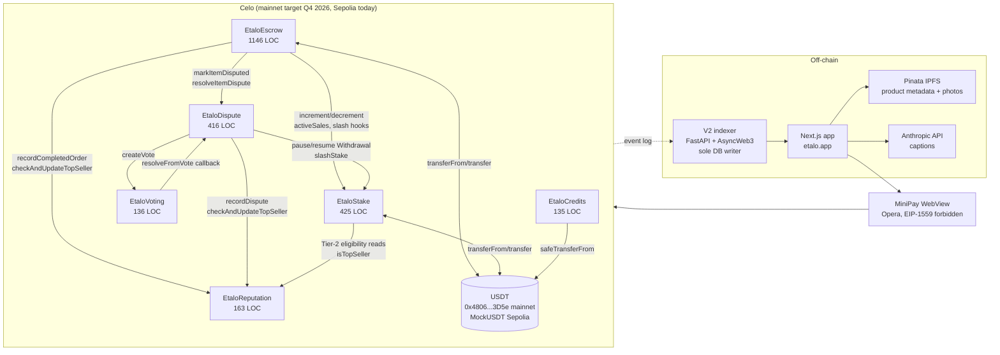

# Etalo V2 — Threat Model

**Audience**: external audit firm, day 1.
**Reading time**: 25–30 minutes.
**Document version**: 1.0 (2026-04-27, Sprint J8 Block 2).
**Branch**: `feat/pre-audit-v2`.

**Companion documents**:

- `docs/SECURITY.md` — runtime invariants, deployed addresses, static-analysis report.
- `docs/DECISIONS.md` — full ADR log (37 entries at the time of writing).
- `docs/SPEC_SMART_CONTRACT_V2.md` — V2 contract specification (state machines, function-by-function).
- `docs/AUDIT_BRIEFING.md` — in-scope code, hot spots, contact info (Block 4, incoming).

This document maps the V2 smart-contract perimeter that an external auditor will inherit. It captures the trust model, per-contract surfaces, privileged roles, architectural caps, V1/V1.5 boundaries, the five fix-driven ADRs already caught pre-audit, and the test methodology backing every claim. Cross-references use file paths with line numbers (e.g. `EtaloEscrow.sol:61`) and ADR identifiers (e.g. ADR-026).

---

## 1. System overview

### 1.1 Mission and non-custodial positioning

Etalo is a non-custodial social-commerce escrow for African sellers, deployed on Celo and surfaced inside the MiniPay wallet. The non-custodial claim follows the Zenland / Circle Refund Protocol / OpenSea standard codified in ADR-022: funds live in public smart contracts, source code is verified on three independent explorers (CeloScan, Blockscout, Sourcify), every administrative power is structurally bounded by code, and every dispute terminates through a permissionless three-level chain (N1 48h → N2 7d → N3 14d). No off-chain authority can move buyer funds outside those rails.

### 1.2 Architecture diagram



### 1.3 Four canonical flows

1. **Intra-Africa happy path** — buyer funds an order, seller ships, item is auto-released after three days (two for a Top Seller). Commission is `1.8%` (`120 BPS` for Top Seller). No stake required.
2. **Cross-border order with progressive release (ADR-018)** — `createOrder` reverts unless the seller has met the applicable Tier 1/2/3 stake (ADR-020). Funds are released `20% / 70% / 10%`: 20% on shipping proof, 70% at destination-country arrival + 72h without dispute, the final 10% on buyer confirmation or auto-release five days after the majority release.
3. **Dispute escalation** — N1 amicable bilateral (48h), then N2 with an admin-assigned approved mediator (7d), then N3 community vote among the remaining mediators (14d). Resolution is always code-enforced; tied N3 votes default to the buyer (ADR-022).
4. **Credits purchase (ADR-037)** — sellers buy credits in USDT against `EtaloCredits` to fund off-chain marketing-image generation. Pricing is `0.15 USDT/credit`, immutable per ADR-014. Consumption is tracked off-chain by the backend ledger.

### 1.4 Pointer

State-machine details (order/item statuses, transitions, function preconditions) live in `docs/SPEC_SMART_CONTRACT_V2.md` and are not duplicated here.

---

## 2. Trust model and assumptions

The audit perimeter assumes the following dependencies behave per their published contracts. Each is listed with the protocol's reliance on it and the explicit V1 limitations.

### 2.1 Tether USDT issuer

USDT on Celo (`0x4806...3D5e`, 6 decimals) is the only fund-moving asset. The protocol relies on `transferFrom` and `transfer` returning truthfully and on the issuer not freezing escrowed funds. ADR-007 documents the mainnet `approve` reset-to-zero quirk (an existing non-zero allowance must be set to zero before being raised); `EtaloCredits` uses OpenZeppelin's `SafeERC20.safeTransferFrom` for that reason. No protocol invariant survives an issuer-level blacklist that targets the escrow contract; that risk is named, not mitigated.

### 2.2 Celo validators

Celo runs an Istanbul-BFT consensus with ~5-second blocks. Smoke tests on Celo Sepolia treat one confirmation as final (ADR-006). Reorg-aware indexer logic (queueing inserts, deletion on reorg detection) is deferred to V1.5 — the V2 indexer assumes single-confirmation finality on testnet and will be re-evaluated on mainnet.

### 2.3 MiniPay WebView (Opera)

MiniPay is the Opera Mini-built WebView wallet that the Mini App runs inside. The protocol must obey two MiniPay-specific constraints: legacy / CIP-64 transactions only (EIP-1559 is rejected), and no signed-message authentication for backend access (ADR-034). The existing EIP-191 surface in `lib/eip191.ts` and `app/auth.py` is flagged for removal before the Proof-of-Ship submission and replaced by on-chain events captured by the indexer. The frontend itself is out of scope for V1 audit (Section 10).

### 2.4 Pinata IPFS

Product metadata, product photos, and dispute evidence photos are pinned through Pinata. The protocol relies on Pinata for retrieval availability but does not store secrets there. Eventual-consistency delays are acceptable because no fund-moving function reads IPFS state. Pinata censorship is not mitigated in V1.

### 2.5 Anthropic API

The asset-generator pillar calls the Anthropic API for caption generation. This path is off-chain, does not move funds, and is gated by the `EtaloCredits.purchaseCredits` payment. A failure of Anthropic at most blocks new caption generation; it cannot affect on-chain state.

### 2.6 Indexer backend (sole DB writer — V2 invariant 14)

The V2 indexer (`backend/app/indexer_v2.py` and the `services/` mirror layer) is the sole writer to the on-chain mirror tables (`orders`, `items`, `groups`, `disputes`, `stakes`, `reputation_cache`). API route handlers may only append off-chain JSONB metadata (delivery photos, dispute conversation, IPFS hashes). This invariant is recorded as rule 14 in `CLAUDE.md` and is the architectural follow-through of ADR-030 (sole-authority pattern, applied at the off-chain layer). The audit firm does not need to read the indexer code to validate the contract surface, but the boundary is documented because contracts emit the events the indexer relies on.

---

## 3. Per-contract threat surface

Contracts are presented in **wiring topology order**: Reputation → Stake → Voting → Dispute → Escrow → Credits. This matches the deployment ordering enforced by the Hardhat deploy script and by the Foundry invariant setUp at `foundry-test/invariants/Invariants.t.sol:33-78`. Setters are not immutable; they are set once at deploy time and ownership is then transferred to the 2-of-3 Safe multisig (Sprint J8 Block 3).

For each contract: roles · critical state vars · modifiers/invariants · attack vectors considered + mitigations · out-of-scope V1.

### 3.1 EtaloReputation (`EtaloReputation.sol`, 163 LOC)

**Roles** — `owner` (admin); `isAuthorizedCaller[]` whitelist (Escrow + Dispute set via `setAuthorizedCaller`).
**Critical state** — `_reputations[seller]` struct (`ordersCompleted`, `ordersDisputed`, `disputesLost`, `score`, `firstOrderAt`, `lastSanctionAt`, `isTopSeller`, `status`).
**Invariants** — score `0..100`; `disputesLost <= ordersDisputed`; `ordersCompleted` monotonic; Top Seller revoked synchronously on sanction (line 50-53).
**Top Seller criteria (ADR-020)** — `ordersCompleted >= 50` AND `disputesLost == 0` AND `lastSanctionAt + 90 days` elapsed AND `score >= 80` AND `status == Active` (line 97-101). Tier 3 stake gate reads `isTopSeller` so any drift here propagates to staking.
**Vectors considered** — unauthorized writes (mitigated by `onlyAuthorized`); double-counting disputes (mitigated by ADR-030 sole-authority — only Dispute calls `recordDispute`); score overflow (capped to `MAX_SCORE`); replay of `applySanction` (idempotent — re-applying the same sanction simply restamps `lastSanctionAt`).
**V1 out of scope** — token-weighted reputation, decay over time, off-chain attestations.

### 3.2 EtaloStake (`EtaloStake.sol`, 425 LOC)

**Roles** — `owner`; `disputeContract` (set via setter); `escrowContract` (set via setter).
**Critical state** — `_stakes[]`, `_tiers[]`, `_activeSales[]`, `_freezeCount[]`, `_withdrawals[]` struct.
**Tiers (ADR-020)** — Tier 1 Starter `10 USDT`, Tier 2 Established `25 USDT` (`20+ orders, 0 lost, 60d seniority`), Tier 3 Top Seller `50 USDT` (Top Seller via Reputation). Lines 18-20.
**Slash + auto-downgrade (ADR-028)** — `slashStake` deducts and recomputes the tier via `_supportedTier(stake)` (line 122-127). Sub-Tier-1 residuals are recoverable via `initiateWithdrawal(StakeTier.None)` with the standard 14-day cooldown.
**Withdrawal freeze (ADR-021)** — `pauseWithdrawal` / `resumeWithdrawal` are reference-counted via `_freezeCount`. The transition `0 → 1` captures `frozenRemaining`; the transition `N → 0` recomputes `unlockAt` from remaining (line 289-314).
**ADR-033 V1.5 fix shipped J8 Block 1** — `topUpStake` and `upgradeTier` now require `stake > 0` instead of `tier != None`, allowing recovery of orphan stakes after a slash that wiped tier eligibility. Sepolia is not redeployed; the diff is documented in the J8 Block 4 briefing.
**Vectors considered** — re-entry on `transfer` (mitigated by `nonReentrant` + ADR-032 strict CEI); under/overflow on `_stakes` arithmetic (mitigated by Solidity 0.8 checked math + explicit `require(stake >= amount)` in `slashStake`); orphan stake drain (covered by `initiateWithdrawal(None)` and ADR-033 V1.5 recovery path); `incrementActiveSales` / `decrementActiveSales` mismatch (mitigated by `onlyEscrow` and the Foundry invariant `invariant_ActiveSalesReconciliation` at line 168-193).
**V1 out of scope** — staking yield, delegated stake, slashing curves.

### 3.3 EtaloVoting (`EtaloVoting.sol`, 136 LOC)

**Roles** — `owner`; `disputeContract` (set via setter, sole external caller).
**Critical state** — `_votes[]`, `_eligibility[voteId][voter]`, `_hasVoted[voteId][voter]`.
**V1 simplifications (ADR-022)** — one-person-one-vote (no token weighting); ties default to the buyer (line 104). Eligible voter sets are managed per-vote by Dispute (not stored globally), which lets Dispute exclude the assigned N2 mediator from the N3 list.
**Vectors considered** — double voting (mitigated by `_hasVoted` map); voting after deadline (mitigated by `block.timestamp < v.deadline`); finalize-then-reuse (mitigated by `finalized` flag and one-shot callback to `IEtaloDispute.resolveFromVote`); spoofed voters (mitigated by per-vote eligibility list authored only by Dispute via `onlyDispute`).
**V1 out of scope** — quadratic voting, delegation, anti-Sybil mechanisms beyond mediator approval.

### 3.4 EtaloDispute (`EtaloDispute.sol`, 416 LOC)

**Roles** — `owner` (admin, approves mediators and assigns N2); `escrow` / `stake` / `voting` / `reputation` (set via setters); `n2Mediator` (per-dispute, set via `assignN2Mediator`).
**Critical state** — `_disputes[]` struct (orderId, itemId, level, deadlines, refundAmount, slashAmount, favorBuyer, resolved); `_n1Proposals[]`; `_voteIdToDisputeId[]`; `_disputeByItem[][]`; `_activeDisputesBySeller[]`; iterable `_mediatorsList[]`.
**FSM** — `LEVEL_NONE → LEVEL_N1 → LEVEL_N2 → LEVEL_N3 → LEVEL_RESOLVED` (constants line 30-34). Once `resolved`, `_applyResolution` is the only state-mutating path that lands the order back in `markItemResolved` and unfreezes the seller stake.
**N3 voter list** — built at escalation time from `_mediatorsList` excluding the assigned `n2Mediator` (line 233-249). Prevents the mediator who already adjudicated N2 from also voting in N3.
**ADR-030 sole authority** — `_applyResolution` is the only call site of `reputation.recordDispute`. Escrow's `resolveItemDispute` does not duplicate the call, eliminating the J4 Block 8 double-count regression.
**ADR-029 N3 cap** — `resolveFromVote` caps refundAmount at `item.itemPrice - item.releasedAmount` so a buyer-favorable N3 vote can never refund more than what is left in escrow (line 327-328). Already-released milestones (20% shipping, 70% arrival per ADR-018) stay with the seller.
**Vectors considered** — re-entry (`nonReentrant` on `openDispute`, `resolveN1Amicable`, `resolveN2Mediation`, `resolveFromVote`); skipping a level (level guards on each escalation); resolving twice (`!d.resolved` guard); voter list gaming (mediator approval is `onlyOwner`, will be 2-of-3 multisig post-J8); orphan dispute when escrow is auto-refunded (mitigated by ADR-031, see Escrow).
**V1 out of scope** — multi-item disputes, mediator reputation slashing, jury staking.

### 3.5 EtaloEscrow (`EtaloEscrow.sol`, 1146 LOC)

**Roles** — `owner` (admin); `commissionTreasury` / `creditsTreasury` / `communityFund` (set via setters, ADR-024); `stake` / `dispute` / `reputation` (set via setters); `legalHoldRegistry` (mapping orderId → reasonHash, ADR-023 condition #3).
**Critical state** — `_orders[]`, `_items[]`, `_groups[]` (ADR-015 hierarchy), `_sellerWeeklyVolume[]`, `totalEscrowedAmount`, `_pauseStartedAt`, `_lastPauseEndedAt`.
**ADR-026 caps** — hardcoded constants at lines 61-72: `MAX_TVL_USDT`, `MAX_ORDER_USDT`, `MAX_SELLER_WEEKLY_VOLUME`, `EMERGENCY_PAUSE_MAX = 7 days`, `EMERGENCY_PAUSE_COOLDOWN = 30 days`, `MAX_ITEMS_PER_GROUP = 20`, `MAX_ITEMS_PER_ORDER = 50`, `FORCE_REFUND_INACTIVITY_THRESHOLD = 90 days`. None are admin-adjustable in V1; raising any cap requires a redeploy.
**`forceRefund` (ADR-023)** — `onlyOwner` AND `disputeContract == address(0)` AND `block.timestamp > order.fundedAt + 90 days` AND `legalHoldRegistry[orderId] != bytes32(0)`. The three conditions are codified in the function body.
**`emergencyPause` (ADR-026)** — auto-expires after 7 days; cannot be re-armed within 30 days of the previous pause. No manual unpause.
**`triggerAutoRefundIfInactive` (ADR-031)** — reverts if any item on the order is `Disputed`, preventing an orphan dispute and an indefinitely-frozen seller stake.
**CEI everywhere (ADR-032)** — every fund-moving function follows Checks → Effects (state writes + events) → Interactions. `_computeNewOrderStatus` is a pure view helper that lets `decrementActiveSales` sit cleanly in the Interactions section.
**Vectors considered** — re-entry on USDT transfers (`nonReentrant` + CEI); commission rounding (computed as `amount * BPS / 10000`, asserted in `invariant_CommissionInRange`); cap bypass via partial fills (caps checked at fund time, never elsewhere); pause griefing (auto-expiry + cooldown); group-level vs item-level state desync (ADR-015 isolation, regression-tested in scenario 3).
**V1 out of scope** — flash-loan composability, gasless meta-transactions, batched checkout (`createAndFund` deferred per ADR-002).

### 3.6 EtaloCredits (`EtaloCredits.sol`, 135 LOC)

**Roles** — `owner` (admin pause / unpause / `setBackendOracle`); `backendOracle` (V1 setter only — no contract logic consumes it; reserved for V1.5+).
**Critical state** — `usdt` (immutable), `creditsTreasury` (immutable, set at construction per ADR-024), `USDT_PER_CREDIT = 150_000` (constant, immutable per ADR-014), `backendOracle`.
**Surface** — single fund-moving function `purchaseCredits(creditAmount)` with `nonReentrant + whenNotPaused`. CEI is strict: checks → emit `CreditsPurchased` → `safeTransferFrom`. The event is the source of truth for the off-chain ledger; consumption is tracked off-chain (ADR-037).
**Vectors considered** — re-entry on `safeTransferFrom` (`nonReentrant`, no state mutation post-call anyway); pricing drift (`USDT_PER_CREDIT` is `constant`, no admin override); treasury redirection (`creditsTreasury` is `immutable`); allowance reset-to-zero (USDT mainnet quirk handled by `SafeERC20`).
**V1 out of scope** — on-chain consumption, refunds (final by design — ADR-022), promo codes, governance over price.

---

## 4. Cross-contract assumptions

### 4.1 Wiring topology (deployment ordering)

Contracts are deployed in topological order: Reputation, Stake, Voting, Dispute, Escrow, Credits. Setters are then called once each — `escrow.setStakeContract`, `escrow.setDisputeContract`, etc. — and ownership is transferred to a 2-of-3 Safe Sepolia multisig in J8 Block 3. Setters are not immutable because deployment ordering forces forward references that no constructor can satisfy in a single transaction. The Foundry invariant suite at `foundry-test/invariants/Invariants.t.sol:33-78` mirrors the production wiring exactly.

### 4.2 Sole-authority pattern (ADR-030 regression)

Reputation events tied to disputes (`recordDispute`) are written by exactly one contract: `EtaloDispute._applyResolution`. `EtaloEscrow.resolveItemDispute` does not call `recordDispute`, even though it owns the item-level state machine. This split was reached after the J4 Block 8 fix where both contracts were calling `recordDispute`, double-counting `disputesLost`. The off-chain mirror (V2 invariant 14) extends the same pattern to the indexer.

### 4.3 Stake auto-downgrade cascade (ADR-028)

`slashStake` triggers `_supportedTier` and emits `TierAutoDowngraded` in the same transaction. The cascade is tested cross-contract in Hardhat integration scenarios (Block 4) and in the Foundry invariant suite (Block 9), which verifies that stake math never diverges from accounting.

### 4.4 Stake freeze coupled to dispute lifecycle (ADR-031)

Every dispute open/close pairs with `pauseWithdrawal` / `resumeWithdrawal`. `triggerAutoRefundIfInactive` refuses to bypass an open dispute precisely so that the freeze always has a `resumeWithdrawal` counterpart on the resolution path. Without this guard, the seller stake could remain frozen indefinitely on an orphaned dispute (the J4 Block 9 Foundry finding).

### 4.5 Trust boundaries and modifiers

The cross-contract ACL is enforced by per-contract modifiers, not by a shared registry. `onlyDispute` (Stake), `onlyEscrow` (Stake), `onlyVoting` (Dispute), `onlyAssignedMediator` (Dispute), `onlyAuthorized` (Reputation). Each modifier reads the corresponding setter slot (`disputeContract`, `escrowContract`, `voting`, `n2Mediator`, `isAuthorizedCaller`). Once ownership transfers to the multisig, all setter calls become governance actions, making the boundaries effectively immutable for the lifetime of V1.

---

## 5. Privileged roles inventory

The protocol exposes a small, enumerable set of privileged roles. After J8 Block 3, every `owner`-scoped function below sits behind a 2-of-3 Safe Sepolia multisig. The list is exhaustive; if an audit finding identifies a function not listed here, it represents a bug or an undocumented power.

| Role | Holder (V1) | Powers |
|---|---|---|
| `owner` (Reputation) | Deployer → 2-of-3 Safe | `setAuthorizedCaller`, `applySanction` |
| `owner` (Stake) | Deployer → 2-of-3 Safe | `setReputationContract`, `setDisputeContract`, `setEscrowContract`, `setCommunityFund` |
| `owner` (Voting) | Deployer → 2-of-3 Safe | `setDisputeContract` |
| `owner` (Dispute) | Deployer → 2-of-3 Safe | `setEscrow`, `setStake`, `setVoting`, `setReputation`, `approveMediator`, `assignN2Mediator` |
| `owner` (Escrow) | Deployer → 2-of-3 Safe | `setStakeContract`, `setDisputeContract`, `setReputationContract`, `setCommissionTreasury`, `setCreditsTreasury`, `setCommunityFund`, `forceRefund` (3 conditions, ADR-023), `emergencyPause` (7d auto-expiry, 30d cooldown, ADR-026), `registerLegalHold` |
| `owner` (Credits) | Deployer → 2-of-3 Safe | `pause`, `unpause`, `setBackendOracle` |
| `disputeContract` | Set once at deploy | Stake hooks `pauseWithdrawal`, `resumeWithdrawal`, `slashStake`; Reputation `recordDispute`, `checkAndUpdateTopSeller`; Voting `createVote`; Escrow `markItemDisputed`, `resolveItemDispute` |
| `escrowContract` | Set once at deploy | Stake hooks `incrementActiveSales`, `decrementActiveSales`; Reputation `recordCompletedOrder`, `checkAndUpdateTopSeller` |
| `assignedMediator` | Per-dispute, by `owner` | `resolveN2Mediation` for that dispute |
| `mediatorsList` | Curated by `owner` | Voter pool for N3, excluding the per-dispute assigned mediator |
| `legalHoldRegistry` | Written by `owner` | Condition #3 of `forceRefund` (ADR-023) |
| `backendOracle` | V1 setter-only | No on-chain power in V1; reserved for V1.5+ `recordConsumption` hook |
| `isAuthorizedCaller[]` | Whitelist set by `owner` | Reputation write access — Escrow + Dispute |

Three properties make this list defensible against role escalation: every `owner` function emits an event, every cross-contract pseudo-role is fixed at deploy time and re-set behind a multisig action, and the per-dispute `assignedMediator` is bounded by the `LEVEL_N2` window (no power before assignment, none after `resolved`). The N3 voter pool is iterable on-chain (`mediatorsCount`, `_mediatorsList`), so the audit firm can enumerate it directly.

---

## 6. Architectural limits (ADR-026)

V1 ships with hardcoded caps that bound the worst-case protocol exposure to 50,000 USDT and bound every admin power in time. None are admin-adjustable; raising any cap requires a redeploy with explicit user communication. The caps are V1 safety nets and are explicitly scoped for lifting post-audit per the ADR-026 Impact section.

| Constant | Value | Location |
|---|---|---|
| `MAX_TVL_USDT` | 50,000 USDT | `EtaloEscrow.sol:61` |
| `MAX_ORDER_USDT` | 500 USDT | `EtaloEscrow.sol:62` |
| `MAX_SELLER_WEEKLY_VOLUME` | 5,000 USDT | `EtaloEscrow.sol:63` |
| `EMERGENCY_PAUSE_MAX` | 7 days | `EtaloEscrow.sol:64` |
| `EMERGENCY_PAUSE_COOLDOWN` | 30 days | `EtaloEscrow.sol:65` |
| `MAX_ITEMS_PER_GROUP` | 20 | `EtaloEscrow.sol:68` |
| `MAX_ITEMS_PER_ORDER` | 50 | `EtaloEscrow.sol:69` |
| `FORCE_REFUND_INACTIVITY_THRESHOLD` | 90 days | `EtaloEscrow.sol:72` |
| `USDT_PER_CREDIT` | 150,000 (0.15 USDT) | `EtaloCredits.sol:36` |
| `TIER_1_STAKE` / `TIER_2_STAKE` / `TIER_3_STAKE` | 10 / 25 / 50 USDT | `EtaloStake.sol:18-20` |

The pause cooldown is intentionally non-bypassable (no manual unpause). Loop bounds (`MAX_ITEMS_PER_GROUP`, `MAX_ITEMS_PER_ORDER`) cap gas cost on every iterating function (`forceRefund`, `confirmGroupDelivery`, `triggerAutoRefundIfInactive`); the longest possible loop is computable and finite.

---

## 7. Known limitations and V1.5+ deferrals

Format: `ADR-XXX — feature, why deferred`.

- **ADR-002** — single-tx `createAndFund` checkout wrapper deferred; V1 ships 3-tx flow because MiniPay does not bundle.
- **ADR-003** — CIP-64 fee-in-USDT deferred; V1 uses CELO gas. MiniPay USDT-fee path requires a separate contract adapter deferred to V1.5.
- **ADR-004** — frontend-driven order sync, superseded by the J5 V2 indexer; listed as historical context only.
- **ADR-007** — USDT mainnet `approve(0)` reset-to-zero quirk handled by `SafeERC20` in `EtaloCredits`; legacy paths in `EtaloEscrow` and `EtaloStake` use raw `transferFrom` because all callers are first-time-allowance flows. Not exploitable in V1 surface.
- **ADR-022** — multisig V3+ deferred; V1 = single-key per treasury wallet, with J8 Block 3 transferring contract ownership (not treasuries) to a 2-of-3 Safe Sepolia.
- **ADR-024** — three-treasury split (`commissionTreasury`, `creditsTreasury`, `communityFund`) locked V1; merging into a single wallet is forbidden.
- **ADR-026** — immutable architectural caps, no governance V1; lifting requires redeploy.
- **ADR-033 V1.5** — `topUpStake` + `upgradeTier` orphan-stake recovery, shipped J8 Block 1 on `feat/pre-audit-v2`. Sepolia is not redeployed; the diff is captured in the J8 Block 4 audit briefing.
- **ADR-034** — EIP-191 backend authentication deprecated. `lib/eip191.ts` and `app/auth.py` are flagged for removal before Proof-of-Ship submission; replacement is on-chain events captured by the indexer. No new mutating flow may add EIP-191 signing.
- **ADR-036** — backend reads use a lightweight `X-Wallet-Address` header in V1; SIWE / EIP-4361 sessions deferred V1.5+.
- **Indexer** — 25 event handlers remain to wire (mostly Dispute lifecycle and Stake withdrawal pause/resume), WebSocket subscriptions and reorg-erase detection deferred V1.5.
- **KYC / AML** — compliance layer deferred V2+; V1 ships with no on-protocol identity gate. Out of scope for the current audit.

---

## 8. Self-audit findings recap (J4–J7 pre-audit)

Format: `ADR-XXX — bug, fix, regression guard`. All findings caught by the team before external audit.

- **ADR-029 (J4 Block 8)** — N3 vote `refundAmount` was uncapped against `remainingInEscrow`, leaving disputes stuck on partial-release orders. Fix: 2-line cap at `EtaloDispute.resolveFromVote` (line 327-328). Guard: Hardhat integration scenario 10 in Block 8 + dedicated unit test.
- **ADR-030 (J4 Block 8)** — `recordDispute` was double-counted via both Escrow and Dispute paths, inflating `disputesLost`. Fix: Dispute is now sole authority; `EtaloEscrow.resolveItemDispute` no longer calls `reputation.recordDispute`. Guard: integration scenario 4 + assertion that `disputesLost` increments by exactly one per resolution.
- **ADR-031 (J4 Block 9 Foundry)** — `triggerAutoRefundIfInactive` ignored `Disputed` items, producing orphan disputes and indefinitely-frozen seller stakes. Fix: revert if any item on the order is `Disputed`. Guard: Foundry `invariant_NoUnexpectedReverts` at `Invariants.t.sol:199` + 1 Hardhat unit + 1 integration test.
- **ADR-032 (J4 Block 10 Slither)** — five `reentrancy-no-eth` Medium findings from Slither across `EtaloStake` and `EtaloEscrow`. Fix: strict CEI refactor everywhere (Checks → Effects with state writes and events → Interactions). Guard: `ReentrancyGuard` retained on every public entry as defense-in-depth; Slither rerun yields 0 Medium.
- **ADR-033 (J4 Block 12 testnet smoke)** — post-slash recovery gap. `topUpStake` required `tier != None`, blocking sellers who had been slashed below `TIER_1_STAKE` from restoring coverage. Fix: V1.5 patch shipped J8 Block 1 (relax to `stake > 0`). Guard: dedicated Hardhat regression test `"ADR-033 V1.5 — topUpStake works on orphan stake post-slash to Tier.None"` plus the Sepolia fixture wallet `CHIOMA` left at `(stake = 5 USDT, tier = None)` for V1.5 patch acceptance.

Methodology callout: every finding followed the same loop — STOP, diagnose, fix, ADR, regression guard. The pattern is reproducible and is the reason no `forceRefund` or `emergencyPause` invariant escaped the J4–J7 self-audit.

---

## 9. Test methodology

### 9.1 Hardhat unit tests — 173 passing

Verified via `npx hardhat test` from `packages/contracts/` on `feat/pre-audit-v2` at commit `3f4f158` (2026-04-27). Composition: 144 J4 (14 Reputation + 34 Stake + 13 Voting + 16 Dispute + 50 Escrow + 16 integration + 1 size-guard) + 24 EtaloCredits J7 + 5 ADR-033 V1.5 J8 Block 1. Suite covers ADR-023 / ADR-026 / ADR-029 / ADR-030 / ADR-031 explicit regression paths.

### 9.2 Foundry invariant suite — 8 invariants, 102,400+ bounded actions, 0 reverts

Seven invariants live in `foundry-test/invariants/Invariants.t.sol` (full V2 wiring, no mocks):

```solidity
invariant_BalanceMatchesTotalEscrowed       // line 86
invariant_TerminalItemStatusIsMonotonic     // line 96
invariant_CommissionInRange                 // line 124
invariant_SlashNeverExceedsDeposited        // line 142
invariant_CompletedOrderStaysCompleted      // line 151
invariant_ActiveSalesReconciliation         // line 168
invariant_NoUnexpectedReverts               // line 199
```

One additional invariant in `foundry-test/invariants/EtaloCreditsInvariant.t.sol`: `invariant_treasuryEqualsCreditsTotal` (line 82, 12,800 bounded actions, 0 reverts).

### 9.3 Integration scenarios — 15 end-to-end (Block 8)

Hardhat-driven, full V2 wiring, treasury balance assertions, reputation deltas. Cover sibling-item isolation (ADR-015), N1/N2/N3 escalation paths, ADR-029 / ADR-030 / ADR-031 regression guards, force refund three-condition matrix, emergency pause cooldown.

### 9.4 Testnet smoke — 5 scenarios on Celo Sepolia (4 executed + 1 unit-only)

Intra-Africa happy path / cross-border 20-70-10 / sibling isolation + N1 amicable / fraud → N2 mediation slash (path that revealed ADR-033) / multi-shipment groups. Scenario 6 (emergency pause cycle) is unit-only — the 7-day auto-expiry cannot be accelerated on public Sepolia. Per-scenario artifacts in `packages/contracts/scripts/smoke/scenarioN-result.json`.

### 9.5 Slither static analysis — 0 H / 0 M / 38 L / 12 I = 50 findings

`slither . --config-file slither.config.json`, version 0.11.5, 101 detectors, no detector silenced by config. Annotation: pre-J7 baseline was 0 H / 0 M / 3 L / 49 I = 52 findings on 5 contracts. Post-J7 baseline expanded to 6 contracts (added `EtaloCredits`); the L category absorbed informational items reclassified by Slither 0.11.5 detector tuning. **Composition shift, not regression** — total decreased (52 → 50), severity ceiling held (0 H, 0 M), and every Low / Informational item is documented inline in `docs/SECURITY.md` with justification.

### 9.6 Forge coverage

Foundry-measured coverage is a lower bound — TypeScript Hardhat tests are not counted. Highest: `EtaloEscrow` 81.56% lines / 83.01% statements. Voting / Stake / Dispute under-counted because their dedicated Hardhat unit suites (13 / 34 / 16 tests) drive paths the invariant handler does not.

### 9.7 Reproducibility

```bash
cd packages/contracts
npx hardhat test                          # 173 passing
forge test --match-path "**/invariants/**" # 8 invariants
slither . --config-file slither.config.json
forge coverage --report summary
```

Sepolia RPC: `drpc.org` (legacy tx envelope, see memory). Verified addresses listed in `docs/SECURITY.md` (CeloScan + Blockscout + Sourcify, triple-explorer).

---

## 10. Out-of-scope V1 audit

**In scope** — the six smart contracts (`EtaloReputation`, `EtaloStake`, `EtaloVoting`, `EtaloDispute`, `EtaloEscrow`, `EtaloCredits`), their cross-contract interactions, the eight Foundry invariants, and the ADR-022 non-custodial criteria.

**Out of scope (deferred V1.5+ or V2+ later audit)**:

- **Frontend code** — Next.js + Wagmi + shadcn/ui. Surface is large but does not move funds; signing happens through MiniPay against the contracts already in scope.
- **Backend FastAPI** — V2 indexer reviewed for the sole-authority pattern (V2 invariant 14) but not full code audit. Audit firm may inspect the boundary as needed.
- **IPFS pinning** — Pinata trust assumption documented in §2.4.
- **Anthropic API** — caption generation, off-chain, non-funds-affecting (§2.5).
- **DeFi composability** — Etalo does not compose with other DeFi protocols in V1 (no flash loans, no AMM integration, no cross-protocol routing).
- **MiniPay WebView** — Opera Software's surface; trust assumption documented in §2.3.
- **Twilio WhatsApp** — off-chain notification side channel.

The 50,000 USDT TVL cap (ADR-026) bounds the financial impact of any vulnerability inside the in-scope perimeter for the lifetime of V1.
